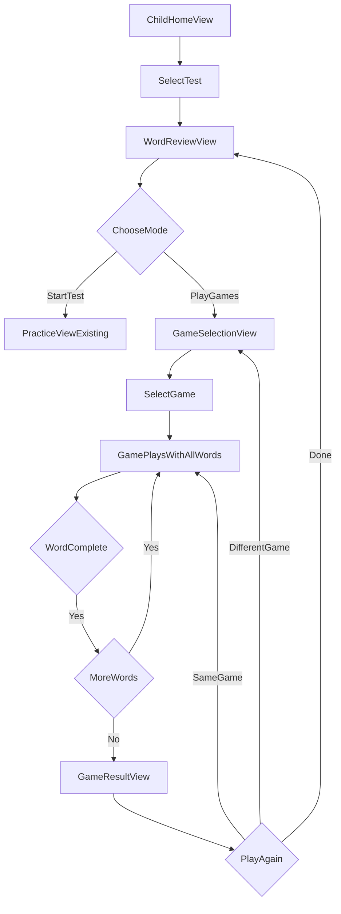

# Interactive Spelling Games - Product Requirements Document

## Executive Summary

Add 5 interactive spelling games to WordCraft that help children reinforce difficult words through engaging gameplay. These games complement the existing practice mode by providing alternative learning approaches that appeal to different learning styles and maintain engagement through variety.

---

## Problem Statement

Currently, WordCraft offers a single practice mode where children listen to words and type them. While effective, this approach:
- Can become repetitive for struggling words
- Relies solely on auditory-to-text translation
- May not engage kinesthetic or visual learners effectively
- Doesn't provide varied reinforcement for difficult words

Interactive games provide:
- Multi-sensory learning (visual, auditory, kinesthetic)
- Gamified repetition without monotony
- Pattern recognition for letter sequences
- Increased engagement through variety

---

## Game Catalog (5 Games)

### Game 1: Balloon Pop

**Concept**: Colorful balloons float upward, each containing a single letter. The target word is displayed with missing letters. Kids tap/shoot balloons to fill in the word in the correct order.

**Mechanics**:
- Word displayed at top with blank slots (e.g., "B _ L L _ _ N")
- Balloons rise from bottom at varying speeds
- Each balloon has one letter (mix of correct and decoy letters)
- Tap a balloon to "pop" it and claim the letter
- Correct letter in correct position: slot fills, celebration animation
- Wrong letter or wrong order: balloon pops harmlessly, gentle shake feedback
- Time pressure: balloons float off screen if not tapped

**Visual Design**:
- Bright sky background with clouds
- Colorful balloon sprites (red, blue, yellow, green, purple)
- Sparkle/confetti effects on correct pops
- Letters in kid-friendly, bold typography

**Difficulty Scaling**:
- Easy: Fewer decoy letters, slower balloon speed
- Medium: More decoys, moderate speed
- Hard: Many decoys, faster speed, multiple balloons per letter

---

### Game 2: Fish Catcher

**Concept**: Fish swim across a river/pond, each carrying a letter on their side. Kids tap fish to catch letters and spell the word in order.

**Mechanics**:
- Word displayed at top with letter slots
- Fish swim left-to-right at different depths and speeds
- Tap fish to catch and add letter to word
- Must catch letters in correct sequence
- Wrong fish: fish swims away with a splash
- Correct fish: fish jumps into bucket with celebration

**Visual Design**:
- Underwater/pond scene with gentle water animation
- Cute, cartoon fish in various colors
- Fishing bucket/net at bottom that fills with caught fish
- Bubble effects and ripples

**Difficulty Scaling**:
- Easy: Fish swim slowly, letters appear in near-order
- Medium: Varied speeds, mixed letter positions
- Hard: Fast swimming, more decoy fish, schools of fish

---

### Game 3: Word Builder (Drag-and-Drop)

**Concept**: Scrambled letter tiles at the bottom, empty slots at the top. Kids drag letters into the correct positions to build the word.

**Mechanics**:
- Target word plays via TTS when game starts
- Letter tiles scattered/scrambled at bottom
- Empty letter slots at top showing word length
- Drag letters to slots; correct placement locks with glow
- Incorrect placement: tile bounces back with wiggle
- Hint system: tap speaker to hear word again
- Optional: reveal first/last letter as help

**Visual Design**:
- Wooden block/tile aesthetic for letters
- Slots look like a word puzzle tray
- Satisfying snap animation when letter placed
- Stars/sparkles on completion

**Difficulty Scaling**:
- Easy: Word outline hints (letter shapes visible)
- Medium: Blank slots only
- Hard: Extra decoy letters included

---

### Game 4: Falling Stars

**Concept**: Letters fall from the night sky like shooting stars. Kids must tap them in the correct spelling order before they fade away.

**Mechanics**:
- Dark sky with twinkling star background
- Target word shown at top
- Letters drift down as glowing stars at random positions
- Tap letters in the correct order to spell the word
- Correct sequence: star adds to constellation forming the word
- Wrong order: star fades with gentle "miss" effect
- Stars fade if not tapped in time

**Visual Design**:
- Magical night sky theme (purple/blue gradient)
- Letters inside glowing star sprites
- Constellation effect: connecting lines appear between collected letters
- Shooting star trail effects

**Difficulty Scaling**:
- Easy: Stars fall slowly, letters appear sequentially
- Medium: Moderate speed, randomized positions
- Hard: Fast falling, multiple letters at once, decoy stars

---

### Game 5: Rocket Launch

**Concept**: A rocket is ready to launch! Type the correct letters in sequence to power up the rocket. Each correct letter adds fuel; complete the word to launch!

**Mechanics**:
- Rocket on launch pad with fuel meter
- Target word displayed as mission objective
- On-screen keyboard or device keyboard input
- Each correct letter: fuel bar fills, rocket rumbles
- Wrong letter: fuel bar pauses, gentle "try again" indicator
- Complete word: countdown animation, rocket launches with celebration
- Speed bonus: faster completion = higher orbit achieved

**Visual Design**:
- Space center/launch pad background
- Colorful rocket with animated flames
- Fuel gauge that fills progressively
- Launch sequence with smoke, fire, and celebration

**Difficulty Scaling**:
- Easy: Letters shown with hints, no time pressure
- Medium: Word hidden after initial display, moderate time
- Hard: Single audio play, strict time limit for bonus

---

## Integration with WordCraft

### Entry Points

```
┌─────────────────────────────────────────────────────┐
│               WordReviewView                         │
│  ┌─────────────────────────────────────────────┐    │
│  │  Words to Practice: balloon, difficult...   │    │
│  └─────────────────────────────────────────────┘    │
│                                                      │
│  ┌─────────────────┐   ┌─────────────────────┐      │
│  │   Start Test    │   │   Play Games        │      │
│  │   (existing)    │   │   (NEW)             │      │
│  └─────────────────┘   └─────────────────────┘      │
└─────────────────────────────────────────────────────┘
                             │
                             ▼
┌─────────────────────────────────────────────────────┐
│              GameSelectionView (NEW)                 │
│                                                      │
│  ┌─────────┐ ┌─────────┐ ┌─────────┐               │
│  │ Balloon │ │  Fish   │ │  Word   │               │
│  │   Pop   │ │ Catcher │ │ Builder │               │
│  └─────────┘ └─────────┘ └─────────┘               │
│  ┌─────────┐ ┌─────────┐                           │
│  │ Falling │ │ Rocket  │                           │
│  │  Stars  │ │ Launch  │                           │
│  └─────────┘ └─────────┘                           │
└─────────────────────────────────────────────────────┘
```

### Gamification Integration

| Element | Integration |
|---------|-------------|
| **Points** | 10 base points per word completed in game mode (same as practice) |
| **Combo** | Consecutive correct taps/actions build combo multiplier |
| **Stars** | Award stars based on performance (time, no mistakes = 3 stars) |
| **Achievements** | New game-specific achievements (see below) |
| **XP/Level** | Games contribute to overall XP progression |

### New Achievements

| Achievement | Description | Icon |
|-------------|-------------|------|
| Game Explorer | Try all 5 spelling games | 🎮 |
| Balloon Master | Complete 10 words in Balloon Pop | 🎈 |
| Fish Whisperer | Complete 10 words in Fish Catcher | 🐟 |
| Star Collector | Complete 10 words in Falling Stars | ⭐ |
| Word Architect | Complete 10 words in Word Builder | 🏗️ |
| Mission Control | Complete 10 words in Rocket Launch | 🚀 |
| Perfect Launch | Complete Rocket Launch with no mistakes | 🎯 |

---

## Technical Architecture

### New Files Structure

```
SpellPlay/
├── Features/
│   ├── Child/
│   │   ├── Games/
│   │   │   ├── GameSelectionView.swift
│   │   │   ├── Common/
│   │   │   │   ├── GameState.swift
│   │   │   │   ├── GameResultView.swift
│   │   │   │   └── GameProgressView.swift
│   │   │   ├── BalloonPop/
│   │   │   │   ├── BalloonPopView.swift
│   │   │   │   └── BalloonView.swift
│   │   │   ├── FishCatcher/
│   │   │   │   ├── FishCatcherView.swift
│   │   │   │   └── FishView.swift
│   │   │   ├── WordBuilder/
│   │   │   │   ├── WordBuilderView.swift
│   │   │   │   └── LetterTileView.swift
│   │   │   ├── FallingStars/
│   │   │   │   ├── FallingStarsView.swift
│   │   │   │   └── StarView.swift
│   │   │   └── RocketLaunch/
│   │   │       ├── RocketLaunchView.swift
│   │   │       └── RocketView.swift
```

### Core Game Protocol

```swift
protocol SpellingGame {
    var currentWord: Word { get }
    var gameState: GameState { get }
    var score: Int { get }
    var starsEarned: Int { get }
    
    func startGame(with words: [Word])
    func completeWord() -> Bool
    func nextWord()
    func endGame() -> GameResult
}
```

### SwiftUI Animation Considerations

- Use `TimelineView` for continuous animations (balloons, fish, stars)
- Use `.animation()` and `withAnimation` for state transitions
- Leverage `Canvas` for high-performance particle effects
- Consider `SpriteKit` overlay for complex game physics (optional enhancement)

---

## User Experience Flow



---

## Success Metrics

| Metric | Target | Measurement |
|--------|--------|-------------|
| Game engagement | 40% of practice sessions include games | Analytics |
| Word retention | 20% improvement on repeat-mistake words | Compare pre/post game performance |
| Session duration | +2 min avg session length | Session tracking |
| Game completion rate | 80% of started games completed | Track starts vs completions |
| Variety usage | Users try 3+ different games | Track unique game plays |

---

## Implementation Priority

**Phase 1 (MVP - 2-3 weeks)**:
1. Game selection UI and navigation
2. Word Builder (simplest mechanics, drag-drop)
3. Balloon Pop (core concept from user)
4. Shared game result/scoring system

**Phase 2 (1-2 weeks)**:
5. Fish Catcher
6. Falling Stars
7. Game-specific achievements

**Phase 3 (1 week)**:
8. Rocket Launch (keyboard input variant)
9. Difficulty settings
10. Polish and performance optimization

---

## Open Questions

1. **Difficulty Selection**: Should difficulty be automatic (adaptive) or user-selected?
2. **Word Source**: Games use all test words, or option to focus on \"difficult words\" only?
3. **Offline Assets**: Should game graphics be bundled or downloadable?
4. **Sound Effects**: Add audio feedback for game actions? (separate from TTS)
5. **Parent Controls**: Should parents be able to enable/disable specific games?

---

## Appendix: Learning Theory Alignment

| Game | Primary Learning Style | Cognitive Benefit |
|------|----------------------|-------------------|
| Balloon Pop | Visual-Kinesthetic | Letter sequence recognition, hand-eye coordination |
| Fish Catcher | Visual-Kinesthetic | Pattern recognition, selective attention |
| Word Builder | Kinesthetic-Spatial | Letter arrangement, spatial memory |
| Falling Stars | Visual-Temporal | Sequential ordering, time management |
| Rocket Launch | Auditory-Motor | Auditory processing, motor memory |

Each game reinforces spelling through different neural pathways, increasing the likelihood of long-term retention compared to single-mode practice.


